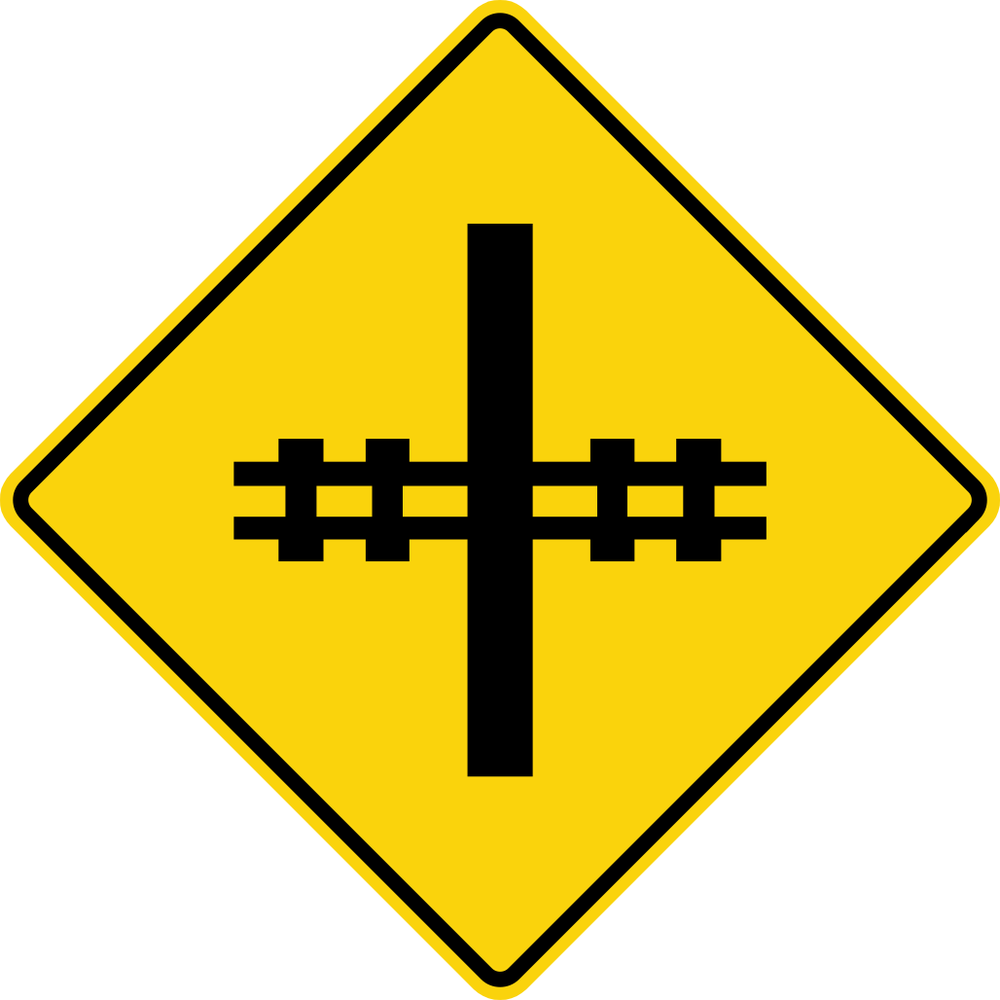

<div align="center">
  
  <br>
  <h1>Railway</h1>
  <p>A track-based React-routing solution, built for apps (and non-determinism)</p>
</div>

Railway is a React-routing system designed for programmatically mapping out user experiences as tracks. Instead of routes, we expect the user experience to deviate at specific points, which lends itself better to full-page transitions instead of hyperlinking between parts of the app.

> Railway is a core technically being used in the [EthicAlly Agent project](https://ethically.ngo) - and is currently being tested and utilized heavily in both payment flows and Electron-based applications. Please check it out! 💜

## Installing

```bash
npm install @ethic/railway
```

## Usage

The examples below build on each-other, so it's worth following them along!

### Getting started (and using Railway deterministically)

First, we need to describe the tracks themselves (at the starting point). This is called a `TrackMap`, and typically described as

```tsx
import { LEFT, RIGHT, DOWN, type TrackMap } from '@ethic/railway';

// These are the expected tracks laid out when the application mounts.
function createDefaultTracks(): TrackMap {
	return new Map([
		['left_page', { position: LEFT, render: () => <LeftPage /> }],
		['right_page', { position: RIGHT, render: () => <RightPage /> }],
		['app', { position: DOWN, render: () => <AppRoot /> }],
		// When within a Railway - 0,0 is always the start coordinate relative to that route. All tracks start here!
		['start', { position: [0, 0], render: () => <Start /> }],
	]);
}
```

If needed, you can also use relative positions (which lends itself to complex tracks - or if you're working with a deterministic layout).

```tsx
import { type TrackMap } from '@ethic/railway';

function createDefaultTracks(): TrackMap {
	return new Map([
		['left_page', { position: [-1, 0], render: () => <LeftPage /> }],
		['right_page', { position: [1, 0], render: () => <RightPage /> }],
		['start', { position: [0, 0], render: () => <Start /> }],
		['app', { position: [0, 1], render: () => <AppRoot /> }],
	]);
}
```

Then (putting it all together), you can describe the application as such:

```tsx
import { useMemo } from 'react';
import { Railway, LEFT, RIGHT, DOWN, type TrackMap } from '@ethic/railway';

// These are the expected tracks laid out when the application mounts.
function createDefaultTracks(): TrackMap {
	return new Map([
		['left_page', { position: LEFT, render: () => <LeftPage /> }],
		['right_page', { position: RIGHT, render: () => <RightPage /> }],
		['app', { position: DOWN, render: () => <AppRoot /> }],
		['start', { position: [0, 0], render: () => <Start /> }],
	]);
}

function App() {
	// for deterministic routing, you should memoize this
	const defaultTracks = useMemo(() => createDefaultTracks(), []);

	return (
		<div class="your-existing-markup">
			<Railway defaultTracks={defaultTracks} />
		</div>
	);
}

// Your remaining React app code...
```

**Important things to note:**

-   `0,0` is always the root - and should be described when Railway is in active use.
-   Every track starts at coordinate 0,0
-   And there's no limit on coordinates. Using the dynamic methods described below, you should generate views perpetually to the left or right if needed

---

### The `useRailway` hook

The `useRailway` hook provides some helpful methods and state:

-   `isCurrentTrack(id: string): boolean` — Checks if the given track ID is the current track.
-   `navigateToView(id: string, context?: TrackContext): void` — Navigates to the specified track and optionally sets context.
-   `returnToLast(): void` — Navigates back to the previous track in the journey stack.
-   `registerNewTracks(id: string, initialTrackMap: TrackMap, userStartPosition?: TrackPosition): void` — Registers a new set of tracks, optionally offset from a given position.
-   `deregisterTracks(id: string): void` — Deregisters tracks by ID, or clears all user-defined tracks if no ID is provided.
-   `journeyStack: string[]` — The stack of track IDs representing the navigation history.
-   `returnDirection: Direction | null` — The direction of the last navigation (e.g., 'left', 'right', or 'top'), or null if not applicable.
-   `contextMap: Map<string, any>` — A map storing context objects for each track.
-   `currentPosition: TrackPosition` — The current track's position as a tuple [x, y].
-   `currentTrack: TrackIterDefinition | undefined` — The current track definition, if any.
-   `allTracksAsList: TrackIterDefinition[]` — A flat list of all registered tracks, including dynamically added ones.

---

### Using Railway dynamically (useRailwayTracks)

Railway provides `useRailwayTracks` which allows you to describe the possible view permutations at a given point. This should be used in **most cases**, as it enables describing views deterministically from the existing point on your TrackMap.

```tsx
import { DOWN, RIGHT, useRailwayTracks } from '@ethic/railway';

const createRoutes = () =>
	new Map([
		[
			'create_screen',
			{ position: RIGHT, render: (context) => <Create {...context} /> },
		],
		[
			'more_screen',
			{ position: DOWN, render: (context) => <More {...context} /> },
		],
	]);

export default function MySecondScreen() {
	const railway = useRailway();

	// Describe the routes that are available relative to this specific step. The first value should be unique
	// It does NOT need to be the same name as the track, but for DX - it's often easier to keep it the same
	useRailwayTracks('app', createRoutes);

	return (
		<>
			<button
				onClick={
					() => railway.navigateToView('create_screen') // Routes directly to the screen
				}
			>
				Create screen
			</button>
			<button
				onClick={() =>
					railway.navigateToView('more_screen', {
						// Route with context!
						// These values are passed into the `context` value in the routes
						shouldShowEvenMore: true,
					})
				}
			>
				More screen
			</button>
			<button
				onClick={() =>
					// Takes us to the step that directly lead us to this one (backwards track step)
					// Note that this will be lower on the track
					railway.returnToLast()
				}
			>
				Return
			</button>
		</>
	);
}
```

**Important things to note:**

-   The identifier `app` here names the TrackMap. **This allows for virtualizing tracks that exist in the same place as a already laid track. This allows for complex navigation situations where we want to transition views from that point**
-   All `position` values are relative to the current position on the track. You can create views in infinite space from that point (in all directions, not just laterally).
-   **Views that are earlier in the TrackMap (not just ones that exist beyond) are deactivated beyond a distance of 1** This means that the previous track will still be rendered (which is useful for traversal), the the track two tracks behind will not be rendered. This helps scale the performance for infinite non-determinism.

### Using Railway for linear flows (linear determinism)

For condensed views (like user journeys within a onboarding or payment form), Railway can still be used to great effect, to create directional transitions that don't existing within a straight line - just in a linear fashion.

> This is not ideal for any views where a user might need to branch off into different directions at a given point. If you must, you can use `useRailwayTracks()` at a given point to map out states outside of the base TrackMap - but the DX won't be kind.

```tsx
import { Railway, useLinearTrack, type StepDefinition } from '@ethic/railway';

function MyStepFlow() {
	const showSecondStep = false;

	const allSteps = [
		{
			id: 'firstStep',
			render: () => <FirstStep />,
		},
		// You can conditionally remove steps from your track!
		showSecondStep && {
			id: 'secondStep',
			direction: 'down',
			render: () => <SecondStep />,
		},
		{
			id: 'finalStep',
			direction: 'right',
			render: () => <FinalStep />,
		},
		// But you have to do it manually
	].filter(Boolean) as StepDefinition[];

	// Create the tracks
	const tracks = useLinearTrack(allSteps);

	// Fun fact - Railway uses relative and absolute positioning (so it works in almost every container)
	// Fixed sizing is NOT required either! Each step can have varying dimensions
	return (
		<div style={{ width: '800px', height: '800px' }}>
			<Railway defaultTracks={tracks} className="my-custom-classname" />
		</div>
	);
}
```

## Future goals

-   All testing on Railway so far has been done manually, but `vitest` tests should be added soon!
-   Right now, Railway is used mostly to create tracks that traverse top to bottom, or left to right. With correct use cases, `UP` could be provided
-   Sandbox!
